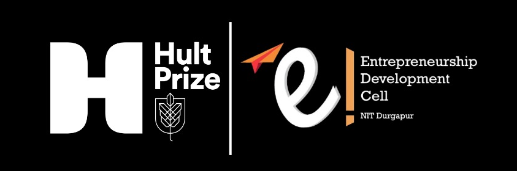

# Hult Prize NIT Durgapur

<p align="center">
  
</p>

<p align="center">
  <strong>Official web platform for managing Hult Prize at NIT Durgapur</strong><br>
  The world's largest student startup competition focused on social entrepreneurship and sustainable development
</p>

---

## About the Competition

The **Hult Prize** is a prestigious global competition that challenges students to solve the world's most pressing issues through social entrepreneurship. Participants compete for a USD 1 million prize to launch their startup and create meaningful impact aligned with the United Nations Sustainable Development Goals.

## About EDC NIT Durgapur

The **Entrepreneurship Development Cell (EDC)** at NIT Durgapur is the official organizer of the Hult Prize on-campus competition. EDC is dedicated to fostering entrepreneurial spirit and innovation among students by:

- **Organizing Competitions**: Hosting prestigious events like Hult Prize, business plan competitions, and startup challenges
- **Mentorship Programs**: Connecting students with industry experts, successful entrepreneurs, and investors
- **Workshops & Speaker Sessions**: Conducting educational sessions on entrepreneurship, business development, and startup ecosystem
- **Incubation Support**: Providing resources and guidance to student startups and innovative projects
- **Community Building**: Creating a vibrant network of aspiring entrepreneurs and changemakers

EDC serves as the bridge between academic learning and real-world entrepreneurship, empowering students to transform their ideas into impactful ventures.

## Overview

This Django-based web application serves as the central hub for student registration, team management, competition updates, and administrative operations for the Hult Prize on-campus competition at NIT Durgapur.

## Features

### For Students

- **User Registration & Authentication**: Secure account creation with email verification
- **Team Management**: Create teams, invite members, and manage team composition (3-4 members)
- **Team Discovery**: Browse and join existing teams looking for members
- **Competition Information**: Access detailed information about competition timeline, rules, and FAQs
- **Speaker Sessions**: View information about industry experts and past winners
- **Quiz Module**: Interactive quiz system for participants

### For Administrators

- **Team Oversight**: Monitor all registered teams and their members
- **CSV Export**: Download comprehensive team and participant data
- **Content Management**: Manage FAQs, speaker information, and announcements
- **Registration Control**: Enable or disable registration periods

## Technology Stack

- **Framework**: Django 6.0
- **Database**: SQLite (development), PostgreSQL-ready for production
- **Frontend**: HTML5, CSS3, JavaScript
- **Static Files**: WhiteNoise for efficient static file serving
- **Email**: SMTP integration for verification and notifications
- **Authentication**: Django's built-in authentication system with custom user management

## Prerequisites

- Python 3.12 or higher
- pip (Python package manager)
- Virtual environment (recommended)

## Installation

### 1. Clone the Repository

```bash
git clone https://github.com/dakshrohit/hult-prize.git
cd hult-prize
```

### 2. Create Virtual Environment

```bash
python -m venv venv
```

Activate the virtual environment:

**Windows:**

```bash
venv\Scripts\activate
```

**macOS/Linux:**

```bash
source venv/bin/activate
```

### 3. Install Dependencies

```bash
pip install -r requirements.txt
```

### 4. Environment Configuration

Create a `.env` file in the project root directory:

```env
SECRET_KEY=your-secret-key-here
DEBUG=True
EMAIL_HOST_USER=your-email@gmail.com
EMAIL_HOST_PASSWORD=your-app-password
```

**Note**: For Gmail, use an App Password instead of your regular password. Generate one from your Google Account settings.

### 5. Database Setup

Run migrations to create the database schema:

```bash
python manage.py makemigrations
python manage.py migrate
```

### 6. Create Superuser

Create an admin account for accessing the Django admin panel:

```bash
python manage.py createsuperuser
```

Follow the prompts to set username, email, and password.

### 7. Collect Static Files

```bash
python manage.py collectstatic --noinput
```

### 8. Run Development Server

```bash
python manage.py runserver
```

The application will be available at `http://127.0.0.1:8000/`

## Project Structure

```
hult-prize/
├── hultprize/              # Main project settings
│   ├── settings.py         # Django configuration
│   ├── urls.py             # Root URL configuration
│   └── wsgi.py             # WSGI application
├── teams/                  # Teams app (main functionality)
│   ├── models.py           # Database models
│   ├── views.py            # View functions
│   ├── urls.py             # URL routing
│   ├── admin.py            # Admin panel configuration
│   ├── templates/          # HTML templates
│   └── static/             # CSS, JavaScript, images
├── quiz/                   # Quiz module
│   ├── models.py
│   ├── views.py
│   └── templates/
├── db.sqlite3              # SQLite database (development)
├── manage.py               # Django management script
├── requirements.txt        # Python dependencies
└── README.md               # This file
```

## Key Models

### User Management

- **User**: Extended Django user model with email verification
- **Team**: Team information with leader relationship
- **TeamMember**: Individual team member details
- **TeamJoinRequest**: Requests to join existing teams

### Content Management

- **Faq**: Frequently asked questions
- **Speaker**: Information about guest speakers and mentors
- **SpeakersFaq**: Speaker-specific Q&A
- **RegistrationsOpen**: Control registration availability

### Quiz System

- **Question**: Quiz questions with options and answers
- **QuizResult**: User quiz scores and timestamps

## Admin Panel

Access the admin panel at `http://127.0.0.1:8000/admin/` using your superuser credentials.

### Admin Capabilities

- Manage teams and team members
- Add/edit/delete FAQs and speaker information
- Export team data to CSV via `/teamsCSV` endpoint
- Control registration periods
- View and manage quiz questions and results

## Email Configuration

The application sends verification emails for new registrations and team invitations. Configure your email settings in the `.env` file:

**Gmail Configuration:**

1. Enable 2-factor authentication on your Google account
2. Generate an App Password: Google Account > Security > 2-Step Verification > App passwords
3. Use the generated 16-character password as `EMAIL_HOST_PASSWORD`

## URLs and Endpoints

### Public Pages

- `/` - Home page
- `/signup` - User registration
- `/login` - User login
- `/faqs` - Competition information and FAQs
- `/speakers` - Speaker sessions and information

### Authenticated Pages

- `/my-team` - Team management dashboard
- `/create-team` - Create a new team
- `/join-team` - Browse and join teams
- `/quiz` - Quiz interface

### Admin Endpoints

- `/admin/` - Django admin panel
- `/teamsCSV` - Export teams data (staff/superuser only)

## Development Guidelines

### Running Tests

```bash
python manage.py test
```

### Creating Migrations

After modifying models:

```bash
python manage.py makemigrations
python manage.py migrate
```

### Adding Static Files

1. Place static files in `teams/static/`
2. Run `python manage.py collectstatic`
3. Reference in templates: ``

## Production Deployment

### Important Security Settings

Before deploying to production:

1. Set `DEBUG = False` in `settings.py`
2. Generate a new `SECRET_KEY` and store it securely
3. Update `ALLOWED_HOSTS` with your domain
4. Configure a production database (PostgreSQL recommended)
5. Set up proper static file serving (nginx, Apache, or CDN)
6. Enable HTTPS and update `CSRF_TRUSTED_ORIGINS`
7. Configure production-grade email service

### Database Migration

For PostgreSQL:

```python
DATABASES = {
    'default': {
        'ENGINE': 'django.db.backends.postgresql',
        'NAME': 'hultprize_db',
        'USER': 'your_db_user',
        'PASSWORD': 'your_db_password',
        'HOST': 'localhost',
        'PORT': '5432',
    }
}
```

## Contributing

This project is maintained by the EDC NIT Durgapur team. For contributions or issues:

1. Fork the repository
2. Create a feature branch
3. Commit your changes
4. Push to the branch
5. Create a Pull Request

## Support

For technical issues or questions:

- Contact: hultprize.nitdgp@gmail.com
- Repository: https://github.com/dakshrohit/hult-prize

## License

This project is developed for NIT Durgapur's Hult Prize on-campus competition.

## Acknowledgments

- Hult Prize Foundation
- EDC NIT Durgapur
- All student participants and volunteers

---

**Version**: 2.0  
**Last Updated**: December 2025  
**Maintained by**: EDC NIT Durgapur
